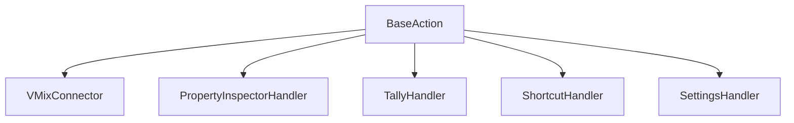
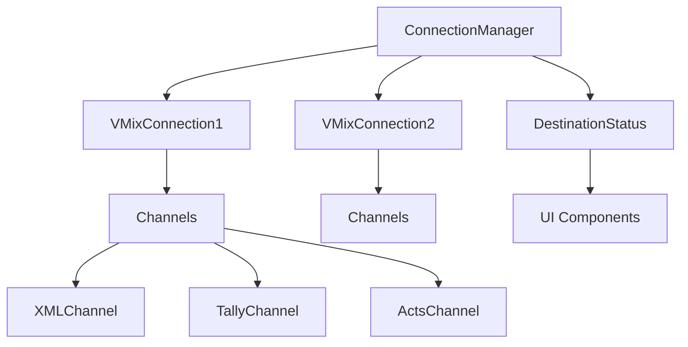
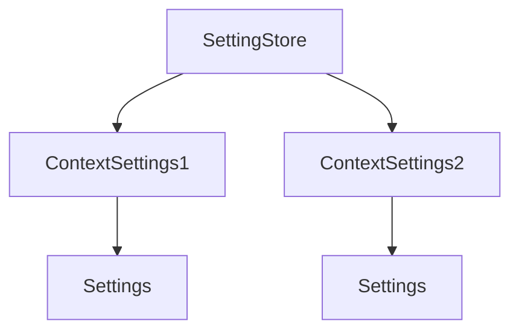
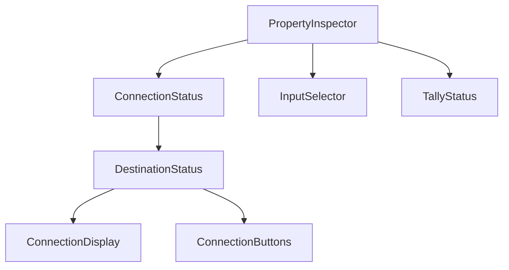

# System Patterns

## Core Patterns

### Handler-based Architecture

- 各機能をハンドラーとして分離
- 必要な機能のみを組み合わせ可能
- インターフェースによる疎結合

### Connection Management

- コンテキストごとの接続管理
- 自動再接続機能
- チャネルベースの非同期通信
- 接続状態の視覚的フィードバック

### Settings Management

- 型安全な設定管理
- コンテキストごとの設定分離
- ジェネリクスによる共通化

### UI/UX Patterns

- 接続状態の一貫した表示
- ユーザーフレンドリーなフィードバック
- コンポーネントの再利用
- 状態に応じたUI更新

### Action Types
1. Preview Action
   - プレビュー入力の切り替え
   - Tally状態の表示
   - 接続状態の表示

2. Program Action
   - プログラム出力の切り替え
   - トランジション設定
   - Tally状態の表示
   - 接続状態の表示

3. Function Action
   - ショートカット実行
   - Acts状態の表示
   - 接続状態の表示

4. Activator Action
   - Acts状態の監視
   - 状態表示
   - 接続状態の表示

## Implementation Guidelines

### Error Handling
- エラーの適切な伝播
- ユーザーフレンドリーなエラー表示
- ロギングによるデバッグ支援
- UI上のエラーフィードバック

### State Management
- Thread-safeな状態管理
- 適切なロック機構
- 状態変更の通知
- UI状態の同期

### Testing Strategy
- ユニットテスト
  - ハンドラーごとのテスト
  - モック利用
- 統合テスト
  - アクション全体のテスト
  - 実際のvMix環境での検証
- UI/UXテスト
  - コンポーネントテスト
  - インタラクションテスト

### Documentation
- コードコメント
- API仕様
- 設定項目の説明
- UI/UXガイドライン